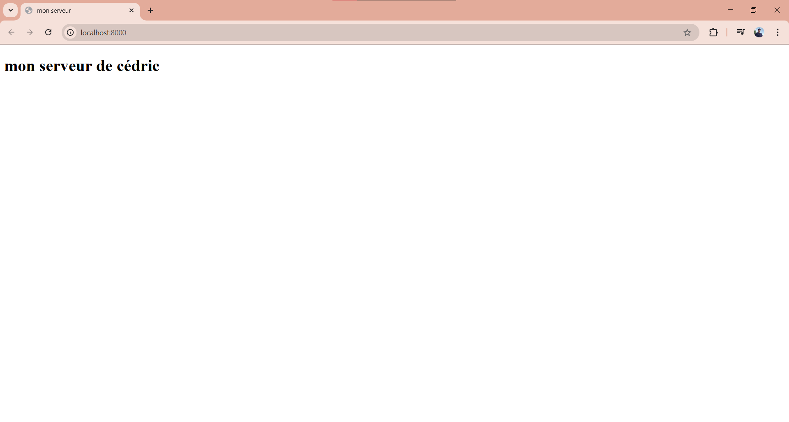
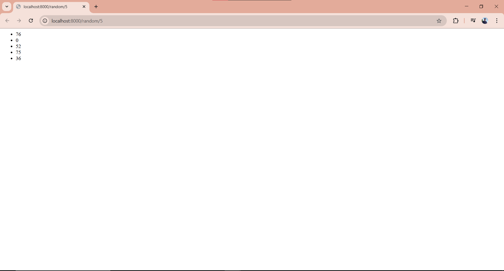

# TP5-dev-web-Maviet-cedric

## CC3 Développement Web


## Partie 1 : serveur HTTP natif Node.js


### Question 1.1  donner la liste des en-têtes de la réponse HTTP du serveur.

En-têtes de la réponse HTTP du serveur :

```
connection keep-alive
date Fri, 19 Sep 2025 22:53:41 GMT
keep-alive timeout=5
transfer-encoding chunked
```


### Question 1.2 donner la liste des en-têtes qui ont changé depuis la version précédente.
En-têtes après ajout JSON :
```
connection keep-alive
content-length 20
content-type application/json
date  Sun, 21 Sep 2025 03:46:04 GMT
keep-alive timeout=5
```


### Question 1.3  que contient la réponse reçue par le client ?

Le fichier **index.html** n'as pas etait trouver par le serveur,  
donc le client reçoit un message d’erreur.


### Question 1.4 quelle est l’erreur affichée dans la console ? Retrouver sur https://nodejs.org/api le code d’erreur affiché.

la console va afficher :
```
Error: ENOENT: no such file or directory, open 'E:\2025 info\semestre 4\dev web\devweb-tp5\index.html'
    at async open (node:internal/fs/promises:642:25)
    at async Object.readFile (node:internal/fs/promises:1279:14) 
  errno: -4058,
  code: 'ENOENT',
  syscall: 'open',
  path: 'E:\\2025 info\\semestre 4\\dev web\\devweb-tp5\\index.html'
```
il s’agit du code erreur : **ENOENT**
 
### Question 1.5 donner le code de requestListener() modifié avec gestion d’erreur en async/await.
```
async function requestListener(_request, response) {
  try {
    const contents = await fs.readFile("index.html", "utf8");
    response.setHeader("Content-Type", "text/html");
    response.writeHead(200);
    response.end(contents);
  } catch (error) {
    console.error(error);
    response.writeHead(500, { "Content-Type": "text/plain" });
    response.end("Erreur 500 : Impossible de charger la page demandee.");
  }
}
```
### Question 1.6 indiquer ce que cette commande a modifié dans votre projet.


Cette commande a ajouter dans le `package.json`:
```
 "dependencies": {
    "cross-env": "^10.0.0"
  },
  "devDependencies": {
    "nodemon": "^3.1.10"
  }

```
 

### Question 1.7 quelles sont les différences entre les scripts http-dev et http-prod ?


la différence entre un http-dev et http-prod est :
http-dev va démarrer le serv  en mode developement ça veut dire que le serv va se relancer si je change mon programme et affiche les détail pour expliquer la situation 

Alors que http-prod va démarrer un serveur en mode production lui il n'affiche pas de messages de debug et ne se relance pas tous seul.


```
[nodemon] 3.1.10
[nodemon] to restart at any time, enter `rs`
[nodemon] watching path(s): *.*
[nodemon] watching extensions: js,mjs,cjs,json
[nodemon] starting `node server-http.mjs`
Server is running on http://localhost:8000
NODE_ENV = development
```

```
E:\2025 info\semestre 4\dev web\devweb-tp5>npm run http-prod

> devweb-tp5@1.0.0 http-prod
> cross-env NODE_ENV=production node server-http.mjs

Server is running on http://localhost:8000
```

### Question 1.8 donner les codes HTTP reçus par votre navigateur pour chacune des quatre pages précédentes.

```http://localhost:8000/index.html``` : 200
 
```http://localhost:8000/random.html``` : 200

```http://localhost:8000/``` : 404

```http://localhost:8000/dont-exist``` :404

## Partie 2 : framework Express

### Question 2.1 donner les URL des documentations de chacun des modules installés par la commande précédente.

la commande précedente donne :

express : https://expressjs.com/en/guide/routing.html 
http-errors  :https://www.npmjs.com/package/http-errors 
loglevel : https://www.npmjs.com/package/loglevel
morgan: https://www.npmjs.com/package/morgan


### Question 2.2 Vérifier que les trois routes fonctionnent

####  http://localhost:8000/


####  http://localhost:8000/random/5


####  http://localhost:8000/random.html


### Question 2.3 lister les en-têtes des réponses fournies par Express. Lesquelles sont nouvelles par rapport au serveur HTTP ?


http://localhost:8000/

```
accept-ranges       bytes
cache-control       public, max-age=0
connection          keep-alive
content-length      133
content-type        text/html; charset=utf-8
date                Wed, 24 Sep 2025 03:51:13 GMT
etag                W/"85-19979d16d51"
keep-alive          timeout=5
last-modified       Wed, 24 Sep 2025 03:43:12 GMT
x-powered-by        Express
```

http://localhost:8000/random/5  :

```
connection        keep-alive
content-length    80
content-type      text/html; charset=utf-8
date              Wed, 24 Sep 2025 03:56:41 GMT
etag              W/"50-0ctZ+nKPrajvQfYKOBmr8JDKCSU"
keep-alive        timeout=5
x-powered-by      Express
```

http://localhost:8000/random.html :


```
connection:               keep-alive
content-length:           150

content-security-policy:  default-src 'none'
content-type:             text/html; charset=utf-8
date:                     Wed, 24 Sep 2025 03:59:42 GMT
keep-alive:               timeout=5
x-content-type-options:   nosniff
x-powered-by :           Express
```

les nouveaux entete sont  :
```
X-Powered-By, 
etag, 
cache-control,
accept-ranges ,
last-modified,
content-security-policy  
x-content-type-options
```

### Question 2.4 quand l’événement listening est-il déclenché ?
```
[nodemon] starting `node server-express.mjs`
File file:///E:/2025%20info/semestre%204/dev%20web/devweb-tp5/server-express.mjs executed.
HTTP listening on http://::1:8000 with mode 'development'
```

L'evénement ```listening``` se déclenche lorsque le serveur Express  commence a écouter le port spécifiés et se lie a l'adresse comme pour le cas de ```localhost:8000``` qui a accepter la requetes http .


### Question 2.5 indiquer quelle est l’option (activée par défaut) qui redirige``` / ```vers ```/index.html ```?

C'est l'option ```index``` du middleware express.static qui a permis de rediriger automatiquement les requêtes vers ```/index.html```. Cette option est activée par défaut et sa valeur est définie comme ```index.html```.


### Question 2.6 visiter la page d’accueil puis rafraichir (Ctrl+R) et ensuite forcer le rafraichissement (Ctrl+Shift+R). Quels sont les codes HTTP sur le fichier style.css ? Justifier.


lorsque on fait CTRL+R pour la premiere fois :
```
GET / 200 18.318 ms - 179
GET /style.css 200 3.186 ms - 81
```
apres la premiere fois  CTRL+R :
```
GET / 304 1.455 ms - -
GET /style.css 304 4.427 ms - -
```
si on fait CTRL+shift+R :
```
GET / 200 1.230 ms - 179
GET /style.css 200 2.512 ms - 81
GET /favicon.ico 404 0.948 ms - 150
```
pour CRTL+R le navigateur utilise un cache
lorsque on fait pour la première fois CRTL+R son code http est 200 puis apres avoir refait
CTRL+R son code http est devenue 304 tandis que pour CRTL+shift+R c est 200 qui recharge la page

